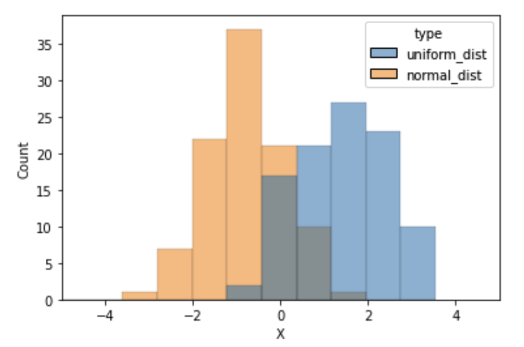
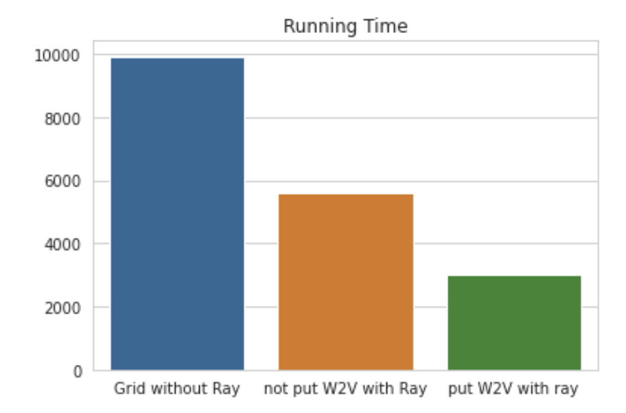
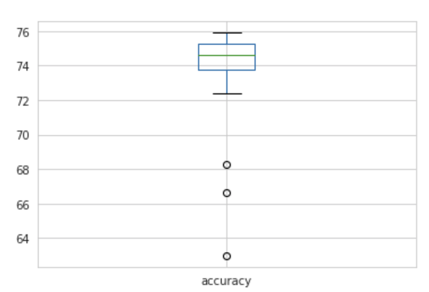
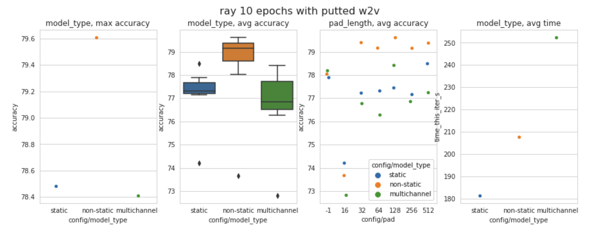
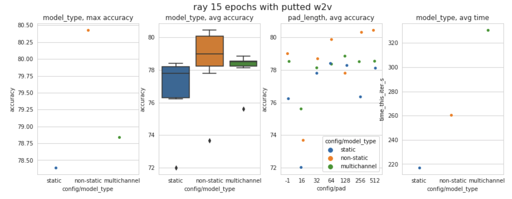
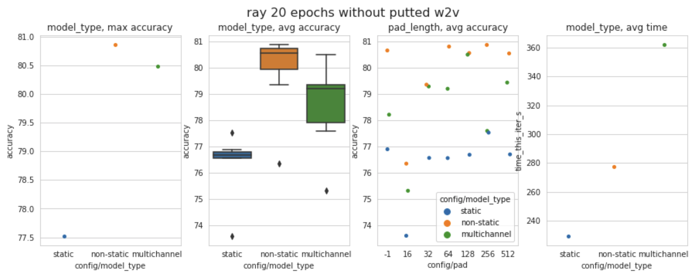
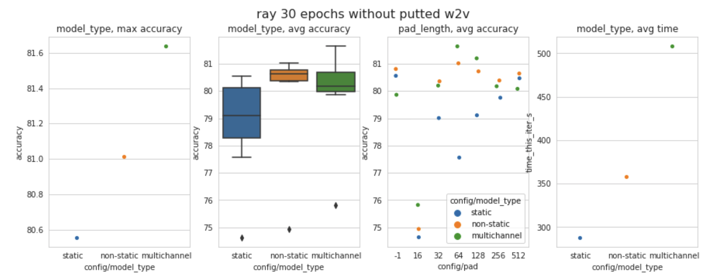
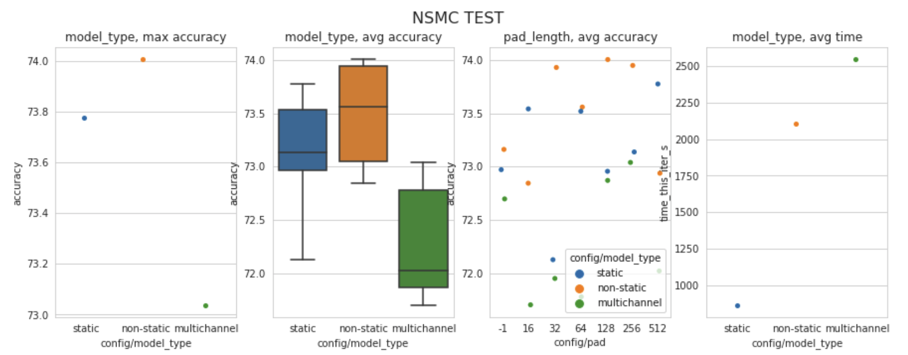

### Results
------
#### What I've learned
- 1D-CNN을 통한 Sentimental Analysis
- torch, Vocabulary, dataset, train에 대한 실질적 구현
- W2V을 통한 Transfer Learning의 진입점
- Multichannel의 경우 다른 모델들 보다 더 많은 학습 에폭이 필요하지만 충분한 학습이후엔 더 좋은 성능을 가짐
- Embedding Initializer 방식에 따라 최대 3~4% 정도의 CV 성능차이가 존재함



#### Additional
- Gradient Descent 내에서 gradient clipping 방식을 통한 안정적인 backpropagation 구현
- Ray를 통한 하이퍼 파라미터 튜닝, Scheduler를 통해 Bayesian Optimization 가능

#### More
- 클래스 추상화 방식
- Ray, ray.tune 클래스 사용 방식 확인 필요 (method, scheduler, reporter등등)
- 저장된 모델의 관리 방식 

------
#### Results Code

### Running time
```python
import pandas as pd
# Grid Search without ray : 9924.6s (epoch10)
# W2V without put with ray : 5611.89s (epoch10)
# W2V with put with ray : 3006.70s (epoch10)
ax = sns.barplot(data=pd.DataFrame([[9924.6, 5611.89,3006.7]], columns=["Grid without Ray","not put W2V with Ray","put W2V with ray"]))
ax.set_title("Running Time")
```

    

    

### Random Init

```python
analysis = Analysis("/home/jack/ray_results/rand_baysian_2/")
ray_rand = analysis.dataframe()[['config/pad', 'config/model_type','loss','accuracy','time_this_iter_s']]
ray_rand['accuracy'].plot.box()
```

    

    


### ray 10 epochs with putted w2v


```python
analysis = Analysis("/home/jack/ray_results/DEFAULT_2021-02-01_11-43-37/")
ray_ep10_w2v_t = analysis.dataframe()[['config/model_type', 'config/pad', 'loss','accuracy','time_this_iter_s']]
plots(ray_ep10_w2v_t, "ray 10 epochs with putted w2v")
```

    

    


### ray 15 epochs with putted w2v


```python
analysis = Analysis("/home/jack/ray_results/DEFAULT_2021-02-01_10-31-23/")
w2v_true_result = analysis.dataframe()[['config/model_type', 'config/pad', 'loss','accuracy','time_this_iter_s']]
plots(w2v_true_result, "ray 15 epochs with putted w2v")
```

    



### ray 20 epochs with putted w2v


```python
analysis = Analysis("/home/jack/ray_results/DEFAULT_2021-02-01_13-21-59/")
ray_ep10_w2v_t = analysis.dataframe()[['config/model_type', 'config/pad', 'loss','accuracy','time_this_iter_s']]
plots(ray_ep10_w2v_t)
```
    

    


### ray 30 epochs with putted w2v


```python
analysis = Analysis("/home/jack/ray_results/DEFAULT_2021-02-01_15-59-33/")
ray_ep30_w2v_t= analysis.dataframe()[['config/model_type', 'config/pad', 'loss','accuracy','time_this_iter_s']]
plots(ray_ep30_w2v_t)
```

    

    


### NSMC data


```python
analysis = Analysis("/home/jack/ray_results/DEFAULT_2021-02-01_20-36-33/")
ray_ep30_w2v_t= analysis.dataframe()[['config/model_type', 'config/pad', 'loss','accuracy','time_this_iter_s']]
plots(ray_ep30_w2v_t)
```

    

