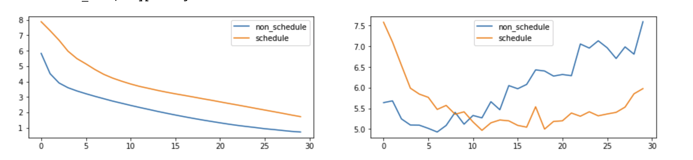

### Results
------
#### What I've learned
- Understand Transformer Architecture
  - Query, Key, Value made by linear projection
  - LM model should learn "Long Term Dependecy"
- Masking Strategy
- Contiguous (C, Fotran)
- Powerful Performance.... (BLEU > 50... in Mulit30K, only training 1epoch/10s)
- Dot-product attention divided by root(d_k) (Simple Answer for Softmax overflow)
- Xavier Initialize is very Useful (Bleu 30 to 50)

#### Additional
- Learning Rate Scheduler
- Linear Layer to Convolution Layer
- KoKoBibleDataset
  - 처음에는 잘 안됨.. (loss가 5밑으로 안떨어짐..) 
  - 문제가 LSTM seq2seq에서 사용한 vocab을 가져왔는데 거기서 역순으로 데이터를 출력하고 있었음. 
  - 이걸 바꾸니 loss 가 쭉쭉 떨어짐 :) -> 근데 또 언제는 떨어지고, 언제는 안떨어지고.. 
    - LR 스케줄러 썼더니.. 엄청 잘됨.... 너무 놀라ㅇ움...
    - {: width="70%" height="100%"}
  - 결과
    - 하나님께서 말씀하셨습니다.
      - predicted trg = gen 1 : 3 하나님 이 가라사대 하나님 이 말씀 하 시 고 <EOS>
    - 하나님이 하늘과 바다를 만드셨습니다.
      - predicted trg = gen 1 : 1 하나님 이 날 을 바다 위 로 하나님 의 물 과 <EOS>
    - 모세와 이삭이 만났습니다.
      - predicted trg = exo 15 : 26 모세 가 이삭 을 보 고 <EOS>

#### More
- Matrix Multiplication (einsum)
- How to Transfer Learninig

